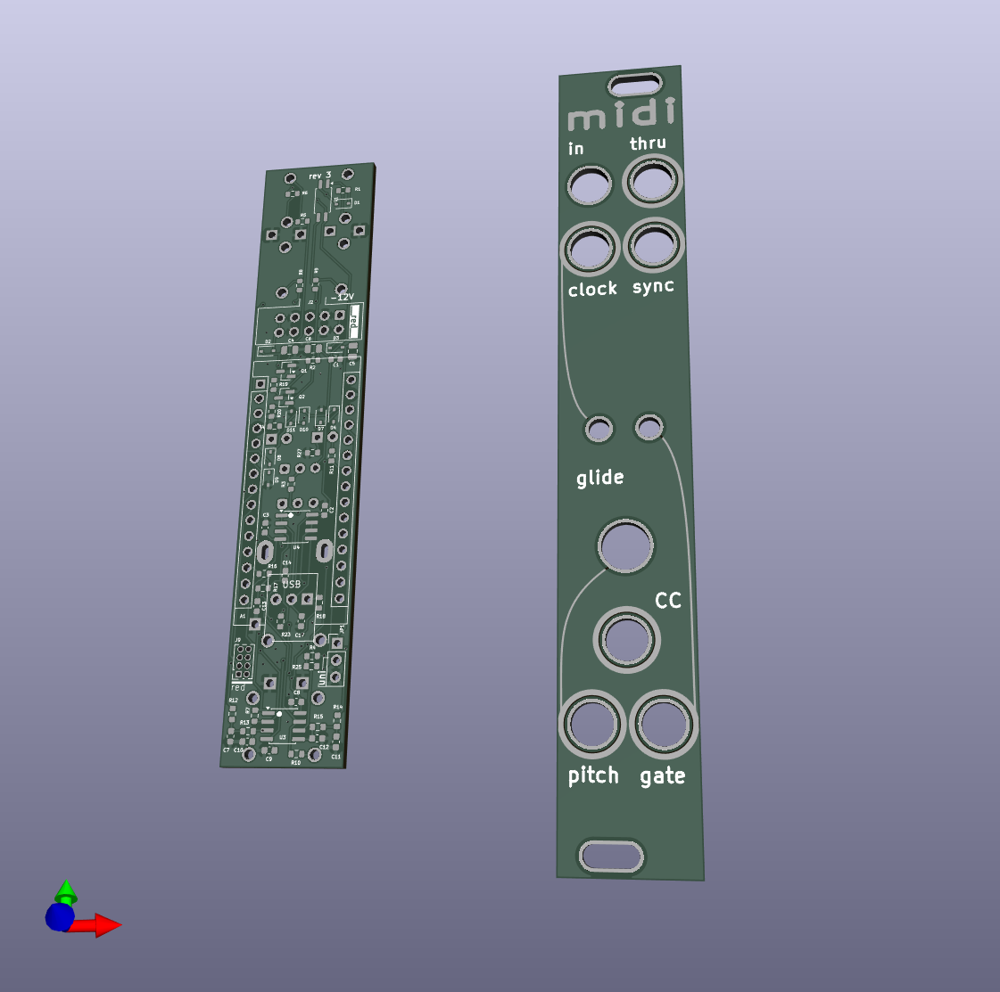

# MIDI Interface

MIDI to Clock, CV and Gate interface in 4 hp wide Eurorack format based on the Arduino Nano v3.

 "3d rendered image of the two boards"

## Functions

* 4hp wide
* TRS MIDI Type A
* Hardware MIDI Thru
* MIDI clock to 16th note clock signal
* MIDI clock to DYN SYNC 24ppqn signal
* MIDI CC using 7 bit PWM Output
* 1V / Octave Pitch CV using 7 bit PWM Output
* Note glide knob
* Note on gate output

## Sources

### Code based on:
* - https://github.com/dhaillant/midi8d
* - https://github.com/kassu/KassutronicsQuantizer
 
### Hardware based on:
* - https://n-audio.net/designing-midi-in-and-midi-out-schematics/
* - https://github.com/dhaillant/midi8d
* - https://github.com/kassu/kassutronics/tree/master/documentation/Quantizer

